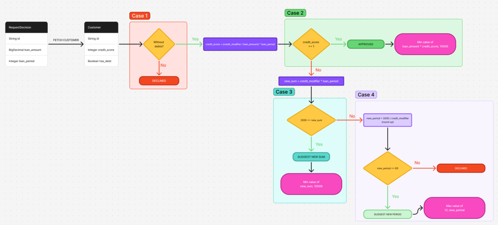

# Decision engine

An API built with Spring Boot 4 for making loan decisions.

After set up, install https://github.com/fyberov-dev/decision-engine-frontend

## Tech Stack

| Technology        | Version |
|-------------------|---------|
| Java              | 25      |
| Spring Boot       | 4.0.4   |
| SpringDoc OpenAPI |         |
| Flyway Migration  |         |
| PostgreSQL        |         |

## Getting Started

### Running using Docker

Find `.env.example` file in a root and remove `.example` from the name of the file and fill with the data

`.env`
```
POSTGRES_DB=postgres
POSTGRES_USERNAME=postgres
POSTGRES_PASSWORD=postgres
```
\* example data for dev purposes

Build project using Gradle

```shell
./gradlew build -x test
```

Create external docker network

```shell
docker network create inbank_solution_backend
```

Run Docker

```shell
docker compose up --build -d
```

### Running locally

Find `application.yaml` and fill the data with your local postgres data

`application.yaml`
```
spring:
    ...
    datasource:
        username: [FILL]
        password: [FILL]
        url: [FILL]
        ...
```

Example:

`application.yaml`
```
spring:
    ...
    datasource:
        username: postgres
        password: postgres
        url: jdbc:postgresql://localhost:5432/postgres
        ...
```

When the database is set up, run the project

```shell
./gradlew bootRun
```

## Use an Application

The application starts on http://localhost:8080/api

Use Swagger documentation on http://localhost:8080/api/swagger-ui/index.html

## How it works

